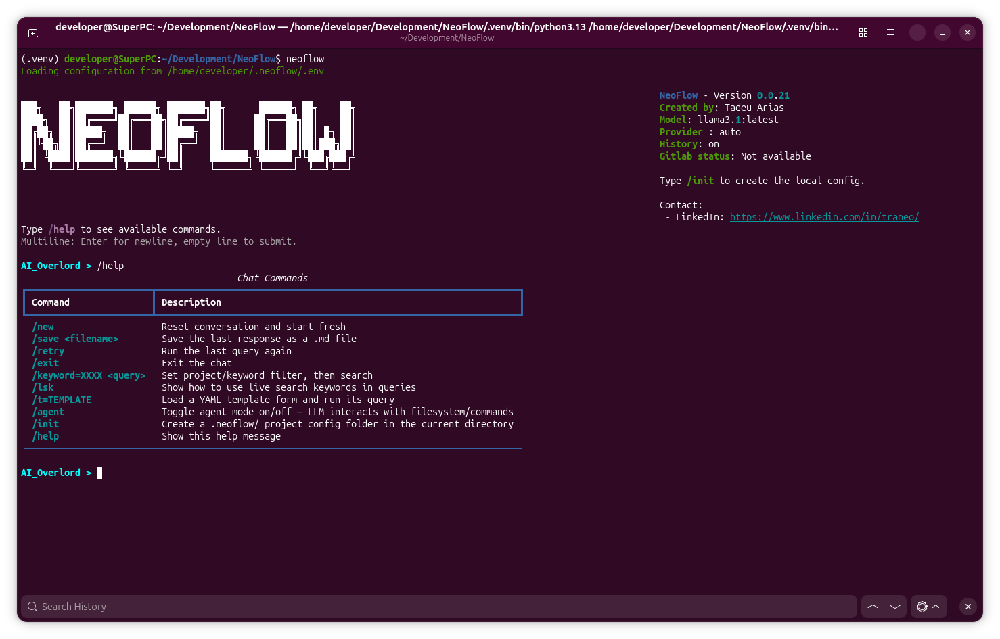

# NeoFlow



## Project Overview

NeoFlow is an AI-powered development assistant designed to streamline the software development process.

## Key Features

- **Code Generation**: Generate code snippets and full implementations based on natural language descriptions
- **Documentation Assistance**: Create and maintain project documentation with AI-powered content generation
- **Testing Support**: Generate test cases and assist with test automation
- **Project Management**: Help organize and manage development projects with intelligent task suggestions
- **Multi-turn Conversations**: Maintain context through session-based chat interactions
- **Template System**: Predefined query templates for common development tasks
- **MCP Server**: Model Context Protocol server for integration with AI coding assistants (VS Code, Claude Desktop, Cursor)

## Installation

### Prerequisites
- Python 3.12 or higher
- Docker (for vector database and or LLM provider)
- GPU with CUDA support (recommended for optimal performance)

### Installation Steps

1. **Clone the repository:**
   ```bash
   git clone https://github.com/traneo/neoflow.git
   cd neoflow
   ```

2. **Create a virtual environment:**
   ```bash
   python -m venv .venv
   source .venv/bin/activate  # On Windows: .venv\Scripts\activate
   ```

3. **Install the package:**
   ```bash
   pip install -e .
   ```

4. **For development (includes testing tools):**
   ```bash
   pip install -e ".[dev]"
   ```

5. **Start the vector database:**
   ```bash
   docker compose up -d
   ```

### Run NeoFlow in a container (default MCP mode)

NeoFlow can run directly in Docker Compose using MCP mode by default (`neoflow server --mcp`).

```bash
# Build and start NeoFlow + dependencies
docker compose up -d --build neoflow weaviate ollama

# Follow NeoFlow MCP logs
docker compose logs -f neoflow
```
### Legacy Mode - If found issue when building it

```bash
export DOCKER_BUILDKIT=0
docker compose up -d
```

## Usage

### Interactive Mode (Default)
```bash
neoflow
```

### Search Mode
```bash
neoflow search -q "your search query"
```

### Server Mode (REST API)
```bash
neoflow server --rest
```

### MCP Server (AI Coding Assistant Integration)
```bash
neoflow server --mcp
```

### MCP Proxy (Remote MCP over HTTP)
```bash
neoflow server --proxy --remote-url http://server.example.com:9721
```

Exposes NeoFlow's capabilities to AI coding assistants like VS Code with GitHub Copilot, Claude Desktop, and Cursor IDE.

For more commands and options:
```bash
neoflow --help
```

## Configuration

Generate local .env for you to change all you need:
```bash
neoflow --config
```

NeoFlow stores runtime templates and agent domain prompts in `~/.neoflow/`:

- `~/.neoflow/templates/`
- `~/.neoflow/agent_system_prompt/`

On first run, default files are copied there from bundled package resources (existing user files are not overwritten).

See [docs/VLLM_SETUP.md](docs/VLLM_SETUP.md) for detailed vLLM configuration.

## Documentation

Comprehensive documentation is available in the [docs/](docs/) directory:

- **[Agent System](docs/AGENT_SYSTEM.md)** - Autonomous task execution
- **[API Server](docs/API_SERVER.md)** - REST API documentation
- **[LLM Providers](docs/LLM_PROVIDERS.md)** - LLM backend options
- **[Template System](docs/TEMPLATE_SYSTEM.md)** - Reusable query templates
- **[Loop Detection](docs/LOOP_DETECTION.md)** - Agent loop safeguards
- **[Dictionary Compression](docs/DICTIONARY_COMPRESSION.md)** - Context compression details

See [docs/README.md](docs/README.md) for the full documentation index.

Note: Project changed faster them I manage to update the docs, it will be in sync eventually. 

## License

This project is licensed under the MIT License - see the [LICENSE](LICENSE) file for details.